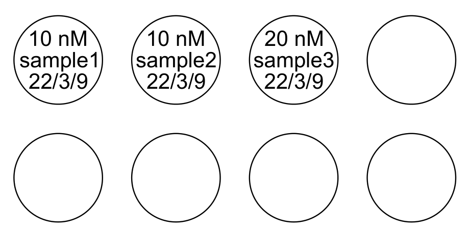

# labelator Python package

This is a Python package for creating PDF documents that can be printed onto circular sticky labels that can be stuck to test tubes. [TODO: look up brand of label paper]

To use, give a list of labels (strings) to the function `write_labels`:

```python
from labelator import write_labels

labels = [
    '10 nM\nsample1\n22-03-09',
    '10 nM\nsample2\n22-03-09',
    '20 nM\nsample3\n22-03-09',
]
write_labels('labels.pdf', labels)
```

This produces a PDF file labels.pdf with 260 circles, most of which are empty, but the first three look like this:




## Table of contents

* [Installation](#installation)
* [Usage](#usage)

## Installation

Two options:

### [NOT SET UP YET] pip (recommended)

To install, run

```
pip install labelator
```


### clone repo

Manually install the packages `drawSvg` and `cairosvg` via

```
pip install drawSvg cairosvg
```

`cairosvg` is just a Python interface to the cairo library; you may also have to install Cairo manually. See https://www.cairographics.org/download/

Then clone this GitHub repo:

```
git clone https://github.com/UC-Davis-molecular-computing/labelator.git
```

Finally, add the directory you just cloned to your PYTHONPATH.

## Usage

The function `write_svg` has required parameters `filename` and `labels`. `filename` must end in .pdf, .svg, or .png; the appropriate file type will be written. `labels` is a list of strings. They are placed one per label in row-major order (i.e., from left to write, then top to bottom) in the 13-column, 20-row grid of label positions.

The full list of parameters:

- *filename*: 
    name of file to write; must end in .pdf, .svg, or .png
- *labels*:
    list of labels (strings) to write. Labels can have newlines; the whole multiline string
        will end up approximately centered in the circle.
- *show_circles*:
    whether to draw a circle around each label reprenseting the sticker boundary.
    Useful for ensuring label text will fit in the sticker, but typically turned off
    before printing the labels.
- *font_size*:
    font size (units are SVG px)
- *dx_text*:
    amount to adjust x position of text within circle (units are SVG px)
- *dy_text*:
    amount to adjust y position of text within circle (units are SVG px)
- *line_height*:
    height of each line; shrink to move lines closer together (units are SVG px)
