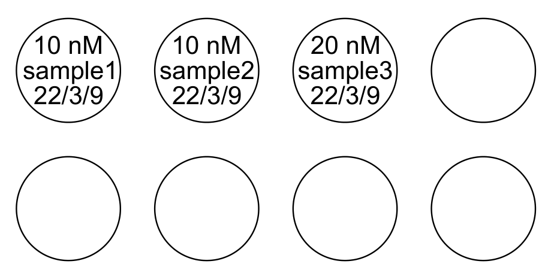
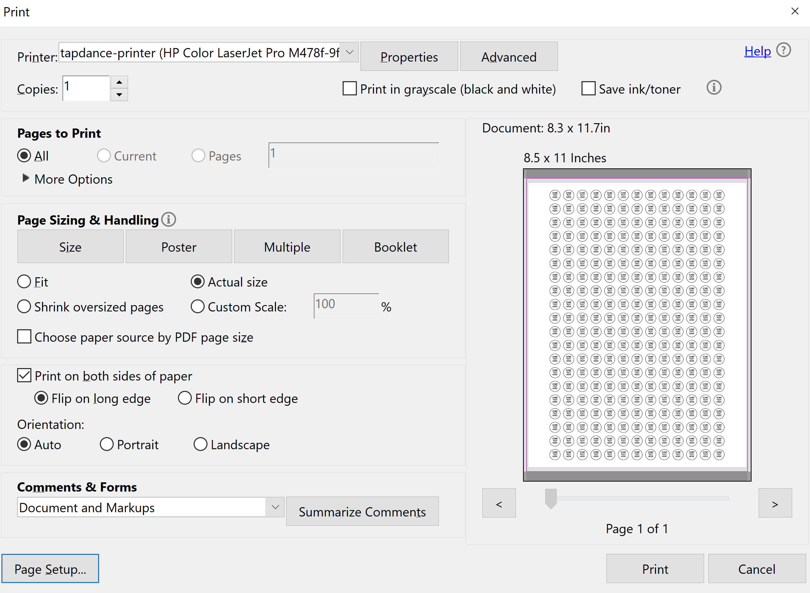
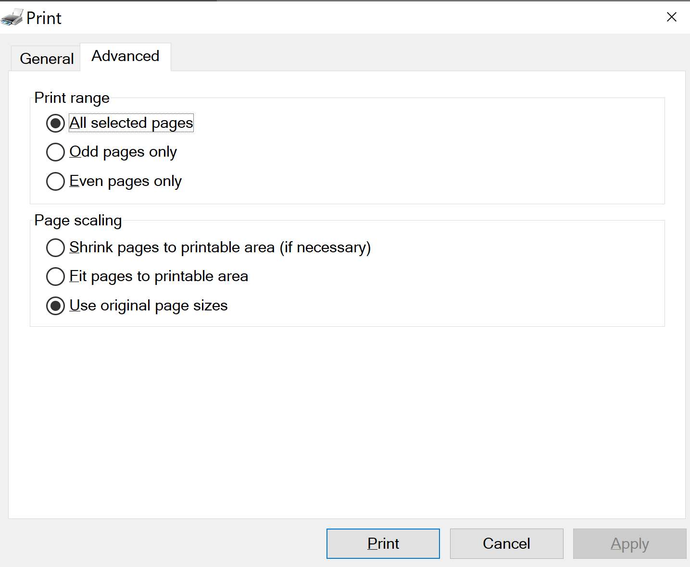

# labelator Python package

This is a Python package for creating PDF documents that can be printed onto circular sticky labels, this particular brand:
https://www.flexilabels.co.uk/a4-sheet-round-labels/260-labels-per-a4-sheet-10-mm-diameter

To use, give the labels (strings) to the function `write_labels`:

```python
from labelator import write_labels

labels = [
    '10 nM\nsample1\n22/03/09',
    '10 nM\nsample2\n22/03/09',
    '20 nM\nsample3\n22/03/09',
]
write_labels('labels.pdf', labels)
```

(One can also specify the `labels` parameter as a 2D list or a dict; see [Usage](#usage) below.)

This produces a PDF file labels.pdf with 260 circles, most of which are empty, but the first three look like this (images only appear when viewed on [GitHub](https://github.com/UC-Davis-molecular-computing/labelator#readme)):




## Table of contents

* [Installation](#installation)
* [Usage](#usage)
* [Printing](#printing)


## Installation

<!-- Two options:

### pip (recommended)

To install, run

```
pip install labelator
```


### clone repo -->

Manually install the packages `drawSvg` and `cairosvg` via

```
pip install drawsvg cairosvg
```

`cairosvg` is just a Python interface to the cairo library; you may also have to install Cairo manually. See https://www.cairographics.org/download/

If you have a Python version prior to 3.8, also install the `typing-extensions` package:

```
pip install typing-extensions
```

Then clone this GitHub repo:

```
git clone https://github.com/UC-Davis-molecular-computing/labelator.git
```

Finally, add the directory you just cloned to your PYTHONPATH. For example, on the Linux bash shell, add this line to your `~/.bashrc` file:

```bash
export PYTHONPATH=$PYTHONPATH:/path/to/labelator
```

where `/path/to/labelator` is the path to the labelator directory you cloned.


## Usage

The function `write_svg` has required parameters `filename` and `labels`. `filename` must end in .pdf, .svg, or .png; the appropriate file type will be written. `labels` describes the text to print onto the labels (see below). 

The full list of parameters:

- *filename*: 
    name of file to write; must end in .pdf, .svg, or .png
- *labels*:
    Description of labels (strings) to write.
    Can be in one of three formats:
    
    - dict mapping (row,col) integer pairs to labels,
    - 2D list of strings,
    - 1D list of strings.
    
    If a 1D list, it will be converted to a 2D list in either row-major or column-major
    order, depending on the value of the parameter `order_by`.
    Labels can have newlines; the whole multiline string
    will end up approximately centered in the circle.
    If a 2D list of strings, each row is described by a list, e.g., `labels[2][3]` describes the label in row 2, column 3.
    If a dict, then the keys are (row,col) pairs, e.g., `labels[(2,3)]` describes the label in row 2, column 3.
- *show_circles*:
    whether to draw a circle around each label reprenseting the sticker boundary.
    Useful for ensuring label text will fit in the sticker, but typically turned off
    before printing the labels.
- *font_size*:
    font size 
    (units are SVG px)
- *dx_text_em*:
    amount to adjust x position of text within circle 
    (units are SVG em)
- *dy_text_em*:
    amount to adjust y position of text within circle 
    (units are SVG em)
- *line_height*:
    height of each line; shrink to move lines closer together 
    (units are percentage of standard line height; 1.0 is standard)
- *font_family*:
    CSS font family; see https://www.w3.org/Style/Examples/007/fonts.en.html
- *font_weight*:
    CSS font weight; see https://www.w3.org/Style/Examples/007/fonts.en.html
- *circle_stroke_width*:
    stroke width of border of circle (if *show_circles* is True)
- *order_by*:
    If *labels* is a 1D list of strings, then this indicates whether to go in row-major order
    ("row") or column-major order ("col").
- *params*:
    *Parameters* object describing adjustment values needed to adapt to specific label paper
    (see labelator.py source code for description of Parameters object)

Here is a call to `write_labels` with the default parameters specified (also some examples of the three formats for `labels`; the first is padded with empty labels for the first two rows to make it print the same as the next two):

```python
labels = ['a', 'b', 'c'] + ['']*10 + \
         ['d', 'e'] + ['']*11 + \
         ['f', 'g', 'h', 'i']
labels = [
    ['a', 'b', 'c'], 
    ['d', 'e'], 
    ['f', 'g', 'h', 'i'],
]
labels = {
    (0, 0): 'a', (0, 1): 'b', (0, 2): 'c',
    (1, 0): 'd', (1, 1): 'e',
    (2, 0): 'f', (2, 1): 'g', (2, 2): 'h', (2, 3): 'i',
}
write_labels(
    filename='labels.pdf',
    labels=labels,
    show_circles=True,
    font_size=8.0,
    dx_text_em=0.0,
    dy_text_em=0.0,
    line_height=1.0,
    font_family='Helvetica',
    font_weight='normal',
    circle_stroke_width=1.33,
    order_by='row',
    params=flexilabels_260_per_a4_sheet,
)
```


## Printing

The PDF produced is intended to match the label positions in this template: https://www.flexilabels.co.uk/uploads/product-files/0-260-labels-per-a4-sheet-10-mm-diameter-flexi-labels-template.pdf

Printing can be finicky. 

1. Choose **A4 paper**.
2. Select "Actual Size", *not* "Fit" or any other scale.

For example, in Adobe Reader:



In Sumatra PDF viewer, this is on the advanced tab:

